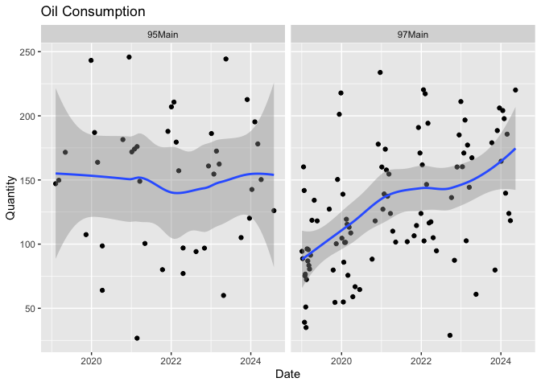
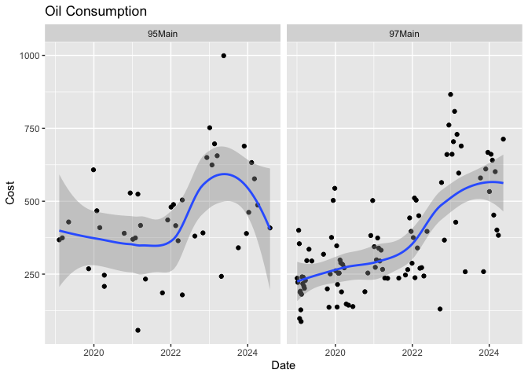
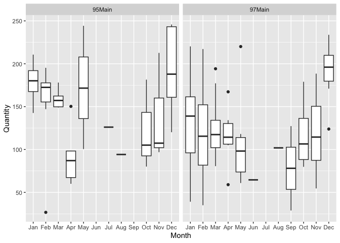
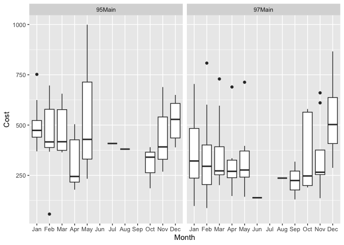
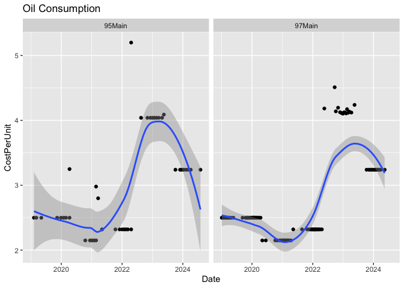

Oil Usage
================
btupper
2024-09-04

We can read in a [merged
table](https://docs.google.com/spreadsheets/d/1Ro1yU67PyDezR2tFYaSLomV7pfX_RGl4IGBuLsnAeW0/edit?usp=drive_link)
to make analysis easier. Here are the first 6 records…

``` r
x = read_downeast() 
knitr::kable(head(x))
```

| Account | Date       | Year | Month | Quantity |   Cost | CostPerUnit |
|:--------|:-----------|:-----|:------|---------:|-------:|------------:|
| 95Main  | 2019-02-06 | 2019 | Feb   |    147.1 | 367.60 |    2.498980 |
| 95Main  | 2019-03-07 | 2019 | Mar   |    149.8 | 374.35 |    2.498999 |
| 95Main  | 2019-05-06 | 2019 | May   |    171.6 | 428.83 |    2.499009 |
| 95Main  | 2019-11-12 | 2019 | Nov   |    107.4 | 268.39 |    2.498976 |
| 95Main  | 2019-12-28 | 2019 | Dec   |    243.2 | 607.76 |    2.499013 |
| 95Main  | 2020-01-29 | 2020 | Jan   |    187.0 | 467.31 |    2.498984 |

Plot a timeseries…

``` r
plot_timeseries(x)
```

<!-- -->

What’s going on at 97 Main St?

How about by cost instead of volume burned?

``` r
plot_timeseries(x, var = Cost)
```

<!-- -->

And a monthly box plot by volume burned.

``` r
plot_monthly(x)
```

<!-- -->

And by cost…

``` r
plot_monthly(x, var = Cost)
```

<!-- -->

## Cost per unit

``` r
plot_timeseries(x, var = CostPerUnit)
```

<!-- -->
